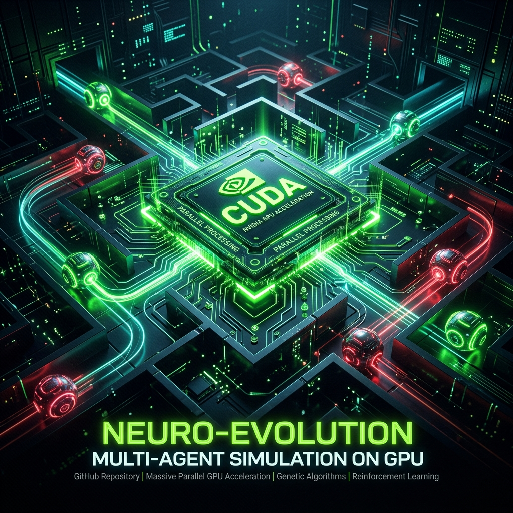
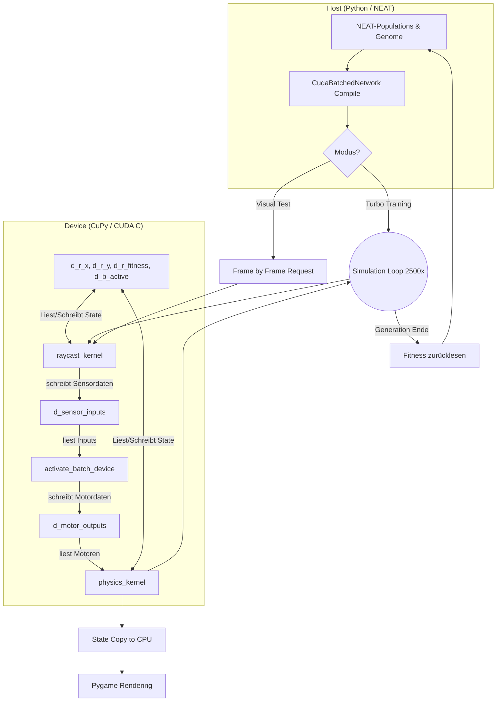

# RoboterEvolution CUDA 🚀



**RoboterEvolution CUDA** ist die hochleistungsfähige, GPU-beschleunigte Weiterentwicklung des [RoboterEvolution](https://github.com/tnickel/RoboterEvolution) Projekts. Es handelt sich um eine Multi-Agenten-Simulation, in der Sammler-Roboter und Jäger-Roboter in einem Ökosystem koevolvieren, gesteuert durch neuronale Netze (NEAT).

Durch den Einsatz von **CuPy** und maßgeschneiderten C-Kernels läuft die gesamte Simulationsschleife – inklusive Raycasting-Sensoren, Physik, Kollisionserkennung und Fitness-Evaluation – direkt auf der Grafikkarte. Dies ermöglicht ein Training, das um Größenordnungen schneller ist als die ursprüngliche CPU-Version.

## 👽 Was ist das hier eigentlich? (Einfach erklärt)

Stell dir vor, wir erschaffen ein digitales Terrarium. In diesem Terrarium setzen wir zwei Arten von kleinen, runden Robotern aus:
1. **Die grünen Sammler (Beute):** Sie müssen kleine gelbe Batterien aufsammeln, um Energie zu tanken. Gleichzeitig müssen sie fliehen, um nicht gefressen zu werden.
2. **Die roten Jäger (Raubtiere):** Sie haben nur ein Ziel – die grünen Sammler fangen, um zu überleben.

**Das absolut Faszinierende daran:** Niemand hat diesen Robotern einprogrammmiert, *wie* man eine Batterie sammelt, Wänden ausweicht oder wie man flieht bzw. jagt. Keine einzige Zeile Code sagt ihnen: "Wenn du einen Jäger siehst, fahre nach links."

Jeder Roboter besitzt ein individuelles "Gehirn" (ein künstliches neuronales Netz). Zu Beginn der Simulation sind diese Gehirne komplett zufällig verschaltet. Die Roboter drehen sich wild im Kreis oder fahren gegen Wände.
Aber sie haben Laser-Augen (Raycasting). Sie können ihre Umgebung "sehen" (Abstände zu Wänden, Batterien oder Feinden). Und nach jeder kurzen Runde greift die **Evolution (Survival of the Fittest)**: Die Roboter, die zufällig etwas besser überlebt oder mehr Batterien gesammelt haben, dürfen ihre "Gene" (die Verbindungen ihres Gehirns) an die nächste Generation weitergeben, leicht mutiert. 

Generation für Generation (gesteuert durch den NEAT-Algorithmus) **lernen die Roboter völlig selbstständig**, komplexe Überlebens- und Jagdstrategien zu entwickeln. Es entsteht ein echtes evolutionäres Wettrüsten zwischen Jägern und Gejagten!

### Und warum "CUDA"? (Die technische Magie)
Eine solche Simulation (hunderte Roboter, zehntausende Laserstrahlen, Physik-Kollisionen und hunderte Gehirne berechnen) ist gigantisch rechenaufwendig. Auf einem normalen Prozessor (CPU) dauert das Lernen extrem lange. 
In diesem Projekt haben wir die **gesamte Welt**, die Physik, das Sehen und die KI-Gehirne direkt auf die **Grafikkarte (NVIDIA GPU)** verlagert. Durch die massive Parallelisierung (CUDA/CuPy) passieren Millionen von Berechnungen gleichzeitig. 
**Das Ergebnis:** Eine komplette Evolutions-Lernphase (2.500 Frames), für die man sonst Minuten bräuchte, wird hier in blitzschnellen **0,8 Sekunden** berechnet! Das ist KI-Training im extremen Zeitraffer.

## 🌟 Kern-Features der CUDA-Architektur

1. **Vollständiger GPU-Bypass (CudaSimulation)**: Im Headless-Trainingsmodus (Turbo-Modus) wird die Python-Schleife komplett umgangen. Die Positionen, Winkel und Lebensdaten aller 100+ Roboter werden als flache Arrays (Structure of Arrays) in den Grafikspeicher geladen. Die Evaluierung von 2.500 Frames findet in Millisekunden statt, ohne dass Daten zwischen CPU und GPU pendeln müssen.
2. **GPU-Raycasting (`raycast_kernel`)**: Jeder Roboter castet 7 bis 14 Laserstrahlen, um Wände, Batterien und Feinde/Beute zu erkennen. Die hochparallele Ausführung auf der GPU verarbeitet abertausende Intersections simultan.
3. **GPU-Physik & Interaktionen (`physics_kernel`)**: Bewegungen, Kollisionen mit Wänden, das Einsammeln von Batterien (inkl. Auto-Respawn über einen Random-Ring-Buffer) sowie das Fressen von Sammlern durch Jäger werden komplett im VRAM via Atomic-Operations berechnet.
4. **Batched Network Evaluation (`CudaBatchedNetwork`)**: Die individuellen NEAT-Genome werden zu einer gigantischen Gewichtsmatrix verschmolzen. Die `activate_batch_device` Methode berechnet die neuronalen Netze der gesamten Population in einem einzigen Aufruf direkt auf den Sensordaten im Grafikspeicher.
5. **Nahtlose Visualisierung**: Trotz GPU-Training bleibt die visuelle Engine mit Pygame erhalten. Nach rasantem Training im Headless-Modus kann jederzeit in den "Visual Test" Modus geschaltet werden, bei dem die GPU-Daten Frame für Frame an die CPU zur Anzeige zurückgemeldet werden.

## 🛠️ Installation & Setup

Stelle sicher, dass du eine CUDA-fähige NVIDIA-Grafikkarte sowie das CUDA Toolkit installiert hast.

1. Klone das Repository:
   ```bash
   git clone https://github.com/tnickel/RoboterEvolutionCuda.git
   cd RoboterEvolutionCuda
   ```

2. Installiere die Abhängigkeiten (vorzugsweise in einer virtuellen Umgebung):
   ```bash
   pip install -r requirements.txt
   ```
   *Wichtig: Stelle sicher, dass `cupy-cuda12x` (oder passend zu deiner CUDA Version) installiert ist.*

## 🚀 Starten der Simulation

Nutze den mitgelieferten komfortablen Launcher:

```bash
start.bat
```

Dies öffnet das Launcher-Menü, in dem du wählen kannst:
* **`1` Headless-Training (CUDA)**: Startet die Evolution mit maximaler Geschwindigkeit. Nutze dies, um in wenigen Minuten hunderte Generationen zu trainieren. Ein GUI-Graphenfenster (Matplotlib) zeigt dir live den Fortschritt.
* **`2` Visueller Test-Modus**: Startet die Pygame-Oberfläche. Du kannst den Robotern dabei zuschauen, wie sie ihre gelernten Flucht- oder Jagdstrategien anwenden. Das Netzwerk-Evaluieren läuft weiterhin über die GPU.
* **`3` Simulation (Menü)**: Öffnet das Konfigurations-Menü, um Parameter wie Populationsgrößen, Speeds und Fitness-Boni anzupassen.

## 📊 Architektur-Übersicht



## 🧠 Neuro-Evolutionäre Dynamik

Durch die verbesserte Leistung können nun echte Räuber-Beute Dynamiken über zehntausende Frames simuliert werden.
* **Sammler (Collectors)** erhalten Belohnungen für das Sammeln von Batterien und gewaltige Fluchtboni, wenn sie dem Sichtfeld eines Jägers entkommen.
* **Jäger (Hunters)** erhalten Energie und Fitness durch das Fressen von Sammlern.
Durch Co-Evolution treiben sich beide Spezies gegenseitig zu immer komplexeren Bewegungsmustern und Ausweichmanövern an.

---
*Entwickelt mithilfe von KI-gestützter CUDA-Architektur-Optimierung.*
